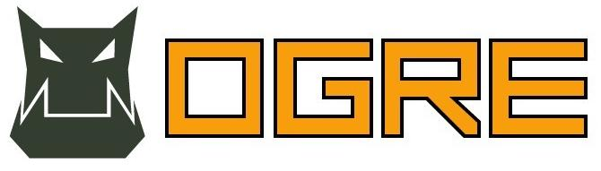
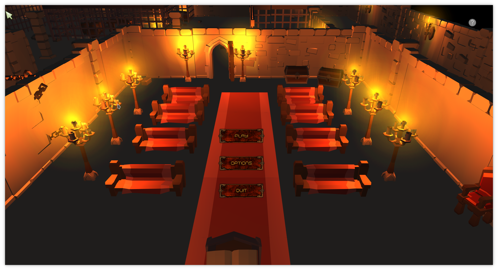
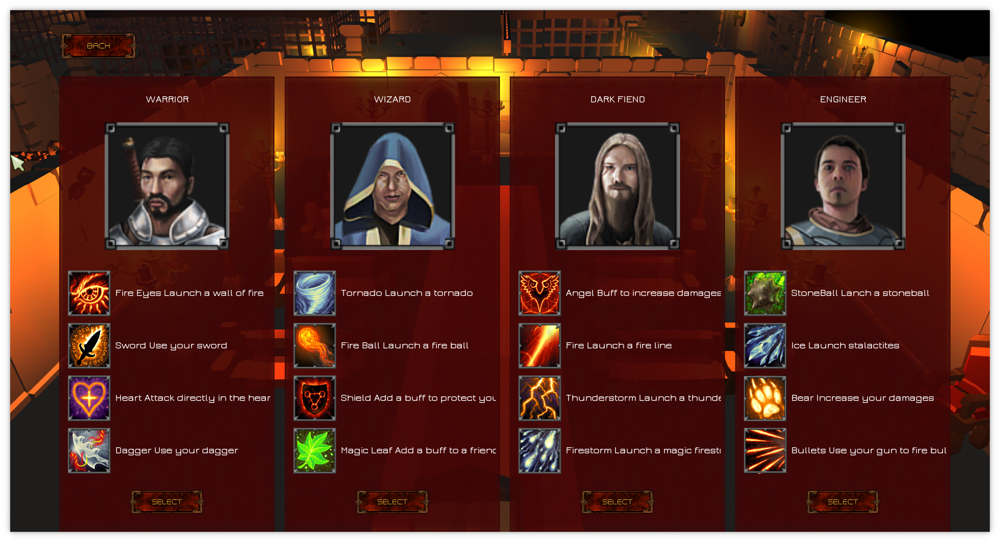
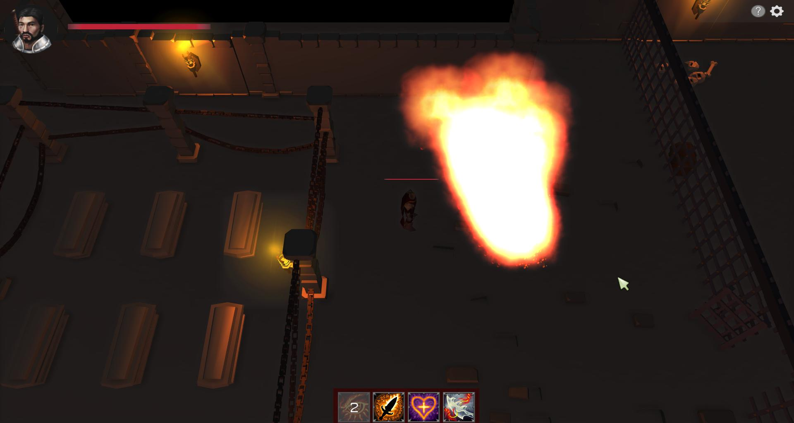
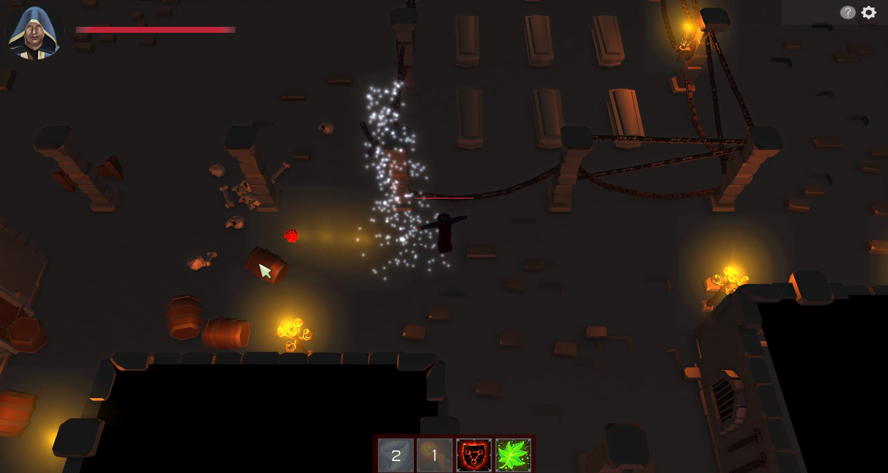
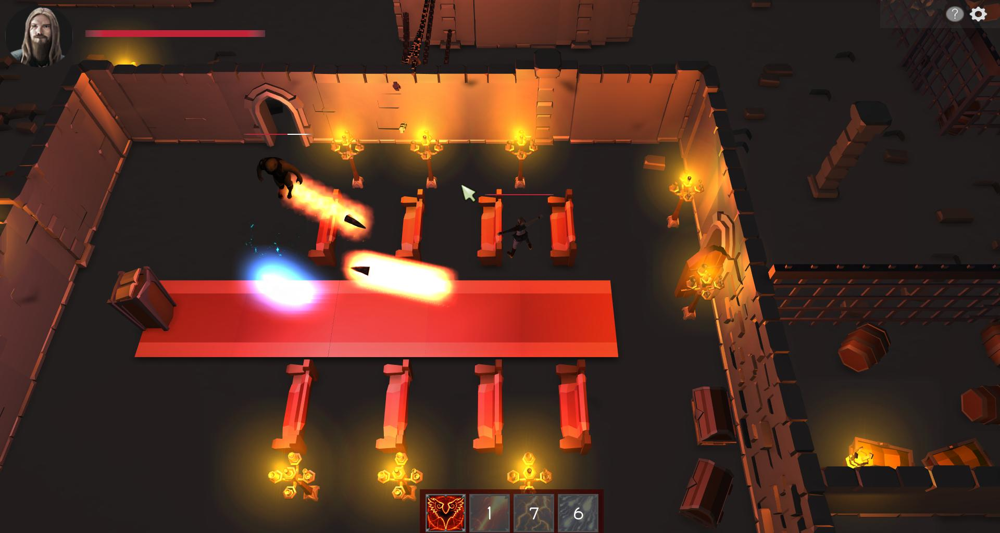
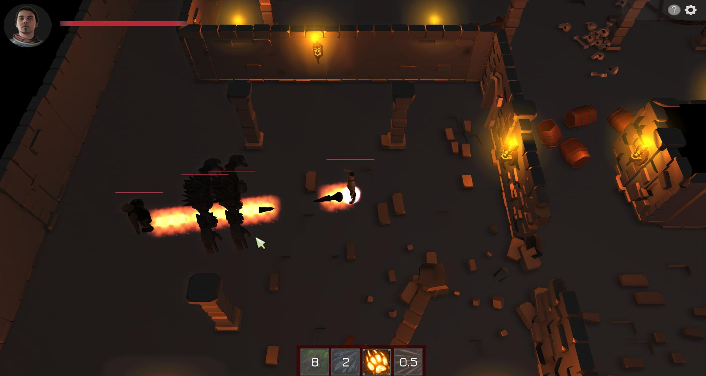

# Epitech - Indie Studio

The goal of this project was to re-create one of these games : Hyper Sprint, Lemmings, Worms, Bomberman, Gauntlet.  
The game had to be compatible with Linux and Windows.  
We chose Gauntlet, and implemente a server for multiplayer.  
You must kill the monsters and survive a maximum of round.
  
The game is not finished and miss functionalities.

## Libraries used:
- Ogre3d for graphic
- BulletPhysics for game physic
- Cegui for HUD
- OpenAl for sound
- OIS and Cegui for input
- SockerIO for multiplayer

<p align="center">
   
   
   <br>
</p>

## Usage:
### Linux:
```bash
git submodule update --init --recursive 
make install
./IndieStudio (in ~/bin/)
```
### Windows:
    Install with Indie-Studio-installer.exe
    Launch Indie-Studio.exe

## Screenshots:

<p align="center">
    <br>
    <br>
    <br>
</p>

## Creators:

###### Rémi Gastaldi
```json
{
  "nom":"Gastaldi",
  "prenom":"Rémi",
  "email":"remi.gastaldi@epitech.eu",
  "linkedin": "https://www.linkedin.com/in/rémi-gastaldi/"
}
```

###### Léo Hubert
```json
{
  "nom":"Hubert",
  "prenom":"Léo",
  "email":"leo.hubert@epitech.eu",
  "linkedin": "https://www.linkedin.com/in/leohubert"
}
```

###### Flavien Sellet
```json
{
  "nom":"Sellet",
  "prenom":"Flavien",
  "email":"flavien.sellet@epitech.eu",
  "linkedin": "https://www.linkedin.com/in/flavien-sellet-32254b10a/"
}
```

###### Prost Matthias
```json
{
  "nom":"Prost",
  "prenom":"Matthias",
  "email":"matthias.prost@epitech.eu",
  "linkedin": "https://www.linkedin.com/in/matthias-prost/"
}
```

###### Cyril Puccio
```json
{
  "nom":"Puccio",
  "prenom":"Cyril",
  "email":"cyril.puccio@epitech.eu",
  "linkedin": "https://www.linkedin.com/in/cyrilpuccio/"
}
```

###### Thomas Augusto
```json
{
  "nom":"Augusto",
  "prenom":"Thomas",
  "email":"thomas.augusto@epitech.eu",
  "linkedin": "https://www.linkedin.com/in/thomas-augusto-8199b710a/"
}
